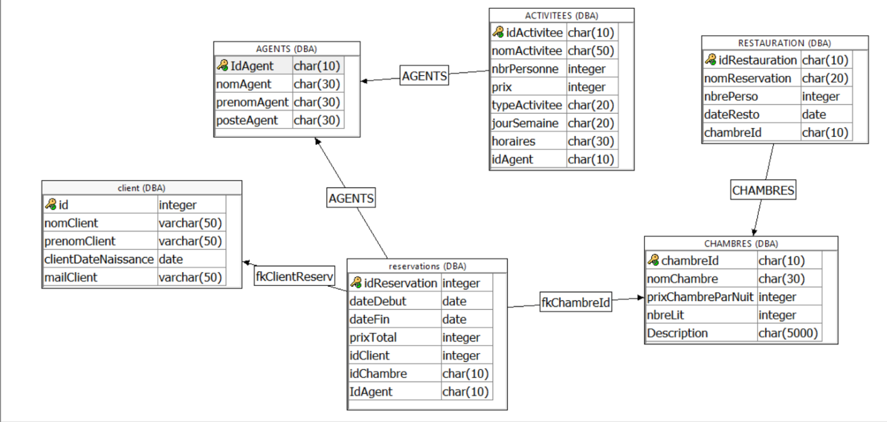

# projet-hotel-ASD

**Étudiants :** KOUVAHE Folly Serge, BLERVAQUE Thomas, PARMENTIER Charles, VOLONT Sébastien

**Classe :** 1TM1

**Description du projet :** Site internet d'un hôtel qui permet de pouvoir réserver des chambres,

**Aspects implémentés :**\
backend : Une base de données permettant de mémoriser les données de réservation encodé par le client.\
backend : Un serveur web capable de fournir les pages html, js, css, ainsi que de proposer des webservices\
backend : Des webservices (avec les procédures associées) :
- Un webservice qui renvoie qui charge la description des chambres depuis la depuis la base de donnée. (KOUVAHE)\
- Un webservice qui permet d'inserer les données dans la table client  après soumission du formulaire réservation. (BLERVAQUE)\
- Un webservice permettant de renvoyer une liste d'activitées proposées par l'hôtel selon le jour de la semaine et le type d'activitée.\
(VOLONT)
- un webservice permettant d'inserer les données dans la table restauration grâce du formulaire de réservation. (PARMENTIER)\

frontend : Une page web (html, js, css) permettant d'appeler les webservices et de traiter les réponses, qui propose une interface utilisateur pour:\
-Réserver sa chambre\
- Réserver une table au restaurant\
-Encoder ses informations (nom, prénom, nombre de personne, date)\
-Permettant de voyager sur différente page du site (Accueil, réservation, Chambres, Contact...)\

